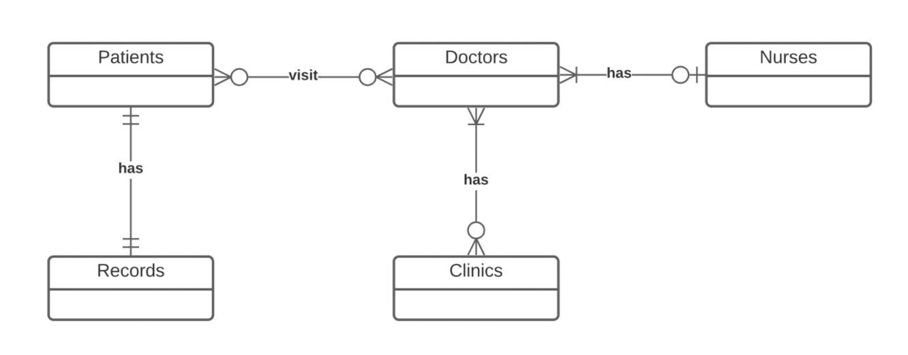
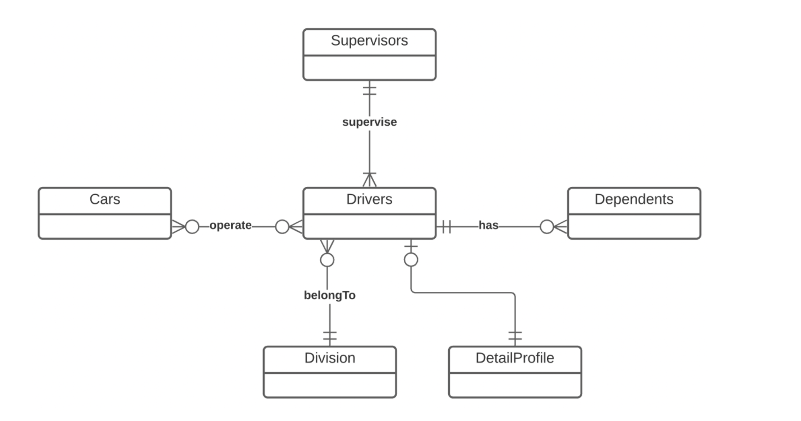
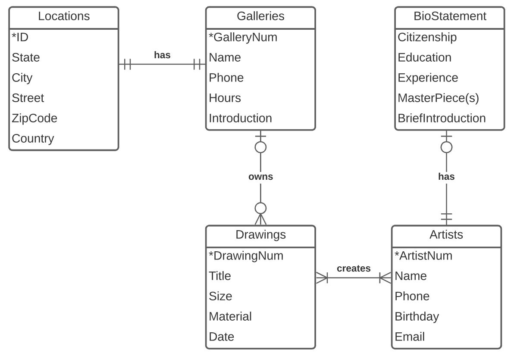

# Question 1: Create an ERD

>"Read the following statements and draw the Entity Relationship Diagram using Crow’s Foot Notation. 
>
>The ER Model is as below:
>- A clinic must have one or more doctors; A doctor may belong to one or more clinics.
>- A patient may visit one or more doctors; A doctor may take one or more patients.
>- A doctor may have one and only one assistant nurse; An assistant nurse must work for one or more doctors. 
>- A patient must have one and only one history record; A record must belong to one and only one patient. 
>
>Now you can draw the ER Diagram based on the ER Model."

# Question 2: Interpret an ERD
>"Read and understand the ERD below, and answer the questions:
>
>
>
>A: What are the entities in the ERD?"

Cars, Supervisors, Drivers, Division, DetailProfile, Dependents

>"B: Translate this ERD to a list of statements. Make sure you address the cardinality and participation using correct terms may, must, one and only one, one or more, etc."

- A car may be operated by one or more drivers; a driver may operate one or more cards.
- A driver must be supervised by one and only one supervisor, and a supervisor must supervise one or more drivers.
- A driver must have a detail Profile, and a detailProfile may belong to one driver.
- A driver must belong to one division, and a division may have one or more drivers.
- A driver may have one or more dependents, and a dependent must belong to one driver.

# Question 3: Create an ERD

>Read the following statements about a Database for Art Galleries and collections of drawings. Draw the Entity-Relationship Attribute Diagram with Crow’s Foot Notation. No credit will be granted for other notations. Make sure you have all entities, all attributes (and identifiers), all relationships, and proper multiplicities.
>
>- A gallery must have one and only one location and each location must have one and only one gallery. 
>- Galleries have attributes: GalleryNum(identifier), Name, Phone, Hours, and Intro. 
>- Locations have attributes: ID(identifier), Country, State, City, Street, and ZipCode.
>- A gallery may have one or more drawings and each drawing may belong to one and only one gallery. 
>- Drawings have attributes: DrawingNum(identifier), Title, Size, Material, and Date.
>- A drawing must be created by at least one artist and each artist must create at least one drawing. 
>- Artists have attributes: ArtistNum(identifier), Name, Phone, Birthday, and Email.
>- An artist may have a bio statement and a bio statement must belong to one artist.
>- BioStatements have attributes: Citizenship, Education, Experience, MasterPiece(s), and BriefIntroduction.

