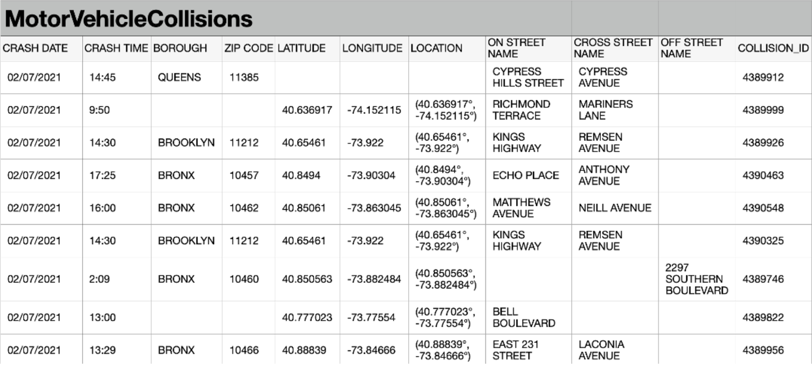

# Question 1: Understand A Relation

>Read the following relation represented as a table and answer the questions.
>
>
>
>- What is the name of this relation: 
>- What is the degree of this relation: 
>- What is the cardinality of this relation: 
>- What might be the primary key of this relation: 
>- What is the domain of ZIP CODE: 
>- What is the domain of CRASH DATE: 

# Question 2: Interpret an ERD

>Translate the ERAD to a Relational Model. Make sure you represent the Relational Model by a set of Relational Schemas, and explicitly represent the primary key(s) and foreign key(s).

https://github.com/kubapeter/portfolio/blob/89c002e23f09457918edd5038a428b7dd68f77be/Coursera%20Courses/Specializations/Databases%20for%20Data%20Scientists/Relational%20Database%20Design/Week%202/img/q1.png
