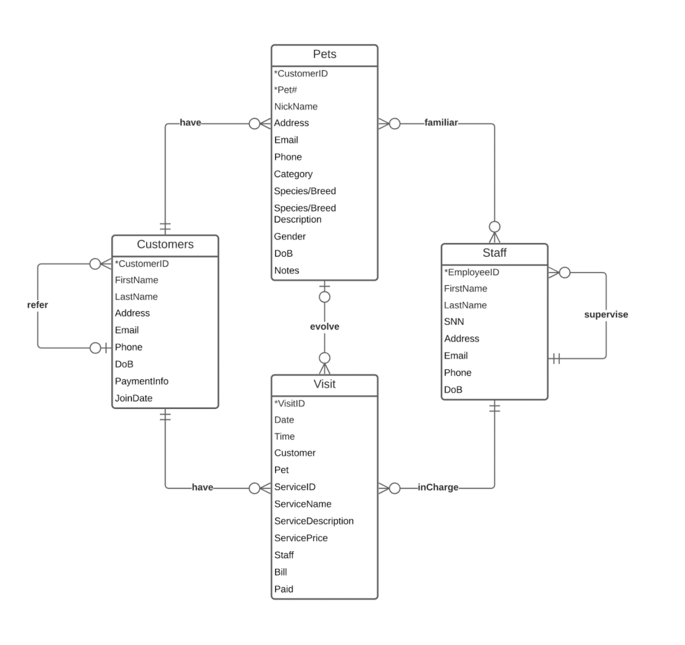

# Step 1: Background

> "Your client, PetsCare, is a local clinic that takes care of pets, including pet wellness and vaccination, medical services, surgery including spay and neuter, dental cleaning and treatment, grooming, etc. PetsCare has served the community for more than 20 years, and has been successful in the business.
> 
> Recently, the current owner, Claire, who is the daughter of the founder of PetsCare, realized that the old file system solution is very inefficient. She and her team have to spend lots of time taking records, querying for information, and maintaining the data. She decided to turn to you, for a Relational Database Management System.
> 
> PetsCare wants to record information about customers, pets, staff, visits. Claire will be available to meet via Zoom tomorrow to discuss details. You should prepare questions for building the DBMS.
> 
> **Task:** What questions should you ask during the meeting?"

One should prepare two categories of questions:

1. The interest of the business, what information should be recorded, what might be the entities for holding the information, what might be used as identities, etc.

2. The relationship of the entities, especially the mandatory/optional participation, and the cardinalities. We will need them to clear confusions and to create the Entity Relationship Model. 

# Step 2: Build the Entity Relationship Model

> "Congratulations! Thanks to the efficient communication between Claire and you, now you understand the details of the business, and you are ready to write down narrative statements for your Entity Relationship Model. 
> 
> You should lay out your own assumptions and your own ER Model."

Here is a summary about the entities:
- Customers: CustomerID, FirstName, LastName, Address, Email, Phone, DoB, PaymentInfo, JoinDate. CustomerID is the identifier.
- Pets: CustomerID, Pet#, NickName, Address, Email, Phone, Category, Species/Breed, Species/Breed Description, Gender, DoB, Notes. CustomerID and Pet# together as the identifier.
- Staff: EmployeeID, FirstName, LastName, SSN, Address, Email, Phone, DoB. EmployeeID is the identifier.
- Visit: VisitID, Date, Time, Customer, Pet, ServiceID, ServiceName, ServicePrice, ServiceDescription, Staff, Bill, Paid. VisitID is the identifier.

Their relationships are:
- A customer may have one or more (zero or more) pets; A pet must belong to one and only one (exactly one) customer.
- A staff may treat one or more pets (zero or more); and A pet may be familiar with one or more (zero or more) staff.
- A customer may have one or more (zero or more) visits; and each visit must be done by one and only one (exactly one) customer. 
- A pet may have one or more (zero or more) visits; and each visit may involve one (zero or one) pet. 
- A staff must be in charge of one or more (one or more) visits; and a visit must be charged by one and only one (exactly one) staff.
- A customer may be referred by one (zero or one) customer; and a customer may refer one or more (one or more) customers. 
- A staff must have one and only one (exactly one) supervisor; A staff may supervise one or more (zero or more) staff.

# Step 3: Create the Entity Relationship Diagram

> "Now you have collected the information needed for the ER Model, and you are ready to draw the ERD."

# Step 4: Convert the ERD to the Relational Model

> "Now you can convert the ERD to a Relational Model."

Here is the relational model converted from the ERD:
- Customers (<ins>CustomerID</ins>, FirstName, LastName, Address, Email, Phone, DoB, PaymentInfo, JoinDate, ReferredByCustomerID(fk)).
- Pets (<ins>CustomerID(fk)</ins>, <ins>Pet#</ins>, NickName, Address, Email, Phone, Category, Species/Breed, Species/Breed Description, Gender, DoB, Notes). 
- Staff (<ins>EmployeeID</ins>, FirstName, LastName, SSN, Address, Email, Phone, DoB, SupervisorID(fk)). 
- Visit (<ins>VisitID</ins>, Date, Time, CustomerID(fk), Pet(fk), ServiceID, ServiceName, ServicePrice, ServiceDescription, EmployeeID(fk), Bill, Paid).
- Pets_Staff (<ins>CustomerID(fk)</ins>, <ins>Pet#(fk)</ins>, <ins>EmployeeID(fk)</ins>)

# Step 5: Normalize the Relational Model to 3NF

> "Before normalization, you should ask Claire about the Functional Dependencies of the relations. Here is what you got from her:
>
> Customers (<ins>CustomerID</ins>, FirstName, LastName, Address, Email, Phone, DoB, PaymentInfo, JoinDate, ReferredByCustomerID(fk)).
>- FD1: CustomerID → FirstName, LastName, Address, Email, Phone, DoB, PaymentInfo, JoinDate, ReferredByCustomerID
>
> Pets (<ins>CustomerID(fk)</ins>, <ins>Pet#</ins>, NickName, Address, Email, Phone, Category, Species/Breed, Species/Breed Description, Gender, DoB, Notes). 
>- FD1: CustomerID, Pet# → NickName, Address, Email, Phone, Category, Species/Breed, Species/Breed Description, Gender, DoB, Notes.
>- FD2: CustomerID → Address, Email, Phone
>- FD3: Species/Breed → Species/Breed Description
>
> Staff (<ins>EmployeeID</ins>, FirstName, LastName, SSN, Address, Email, Phone, DoB, SupervisorID(fk)). 
>- FD1: EmployeeID  → FirstName, LastName, SSN, Address, Email, Phone, DoB, SupervisorID
>
> Visit (<ins>VisitID</ins>, Date, Time, CustomerID(fk), Pet(fk), ServiceID, ServiceName, ServicePrice, ServiceDescription, EmployeeID(fk), Bill, Paid).
>- FD1: VisitID → Date, Time, CustomerID, Pet, ServiceID, ServiceName, ServicePrice, ServiceDescription, EmployeeID, Bill, Paid
>- FD2: ServiceID  → ServiceName, ServicePrice, ServiceDescription.
>
> Pets_Staff(<ins>CustomerID(fk)</ins>, <ins>Pet#(fk)</ins>, <ins>EmployeeID(fk)</ins>)
>- There is no non-primary-key attribute.
>
> Now you can normalize this Relational Model to 3NF."

Here is the normalization process:
- Customers, Staff, and Pets_Staff relations are in 3NF, because they are in 1NF; they have no partial functional dependencies so they are in 2NF; and they have no transitive functional dependencies so they are in 3NF.
- Pets relation is in 1NF. However, it is not in 2NF because FD2: CustomerID → Address, Email, Phone. CustomerID as part of the primary key, determines non-primary-key attributes. This leads to a partial functional dependency. We need to normalize Pets to 2NF:
  - Create a new relation to put CustomerID, Address, Email, Phone. Since Customer relation has these attributes, we can simply remove them from Pets, and keep CustomerID as a foreign key.
  - Pets (<ins>CustomerID(fk)</ins>, <ins>Pet#</ins>, NickName, Category, Species/Breed, Species/Breed Description, Gender, DoB, Notes). 
    - FD1: CustomerID, Pet# → NickName, Category, Species/Breed, Species/Breed Description, Gender, DoB, Notes.
    - FD2: Species/Breed → Species/Breed Description
- Pets relation now is in 2NF. However, it is not in 3NF because of FD2: Species/Breed → Species/Breed Description. (CustomerID, Pet#) → Species/Breed, and Species/Breed → Species/Breed Description is a transitive functional dependency. We need to normalize Pets to 3NF:
  - Create a new relation to put Species/Breed and Species/Breed Description and modify Pets: 
  - Species (<ins>Species/Breed</ins>, Species/Breed Description)
    - FD1: Species/Breed → Species/Breed Description
  - Pets (<ins>CustomerID(fk)</ins>, <ins>Pet#</ins>, NickName, Category, Species/Breed(fk), Gender, DoB, Notes). 
    - FD1: CustomerID, Pet# → NickName, Category, Species/Breed, Gender, DoB, Notes.
- Now Pets relation is in 3NF.
- Visit relation is in 1NF, and 2NF. However, it is not in 3NF because of FD2: ServiceID  → ServiceName, ServicePrice, ServiceDescription. VisitID → ServiceID, and ServiceID  → ServiceName, ServicePrice, ServiceDescription is a transitive functional dependency. We need to normalize Visit to 3NF:
  - Create a new relation to put ServiceID, ServiceName, ServicePrice, ServiceDescription and modify visit.
  - Service (<ins>ServiceID</ins>, ServiceName, ServicePrice, ServiceDescription)
    - FD1: ServiceID  → ServiceName, ServicePrice, ServiceDescription
  - Visit (<ins>VisitID</ins>, Date, Time, CustomerID(fk), Pet(fk), ServiceID(fk), EmployeeID(fk), Bill, Paid).
    - FD1: VisitID → Date, Time, CustomerID, Pet, ServiceID, EmployeeID, Bill, Paid

# Step 6: Final Output for Implementation

> "After the normalization process, summarize the relational model in 3NF."

Now the final Relational Model in 3NF is as below:
- Customers (<ins>CustomerID</ins>, FirstName, LastName, Address, Email, Phone, DoB, PaymentInfo, JoinDate, ReferredByCustomerID(fk)).
  - FD1: CustomerID → FirstName, LastName, Address, Email, Phone, DoB, PaymentInfo, JoinDate, ReferredByCustomerID
- Pets (<ins>CustomerID(fk)</ins>, <ins>Pet#</ins>, NickName, Category, Species/Breed, Gender, DoB, Notes). 
  - FD1: CustomerID, Pet# → NickName, Category, Species/Breed, Gender, DoB, Notes.
- Species (<ins>Species/Breed</ins>, Species/Breed Description)
  - FD1: Species/Breed → Species/Breed Description
- Staff (<ins>EmployeeID</ins>, FirstName, LastName, SSN, Address, Email, Phone, DoB, SupervisorID(fk)). 
  - FD1: EmployeeID  → FirstName, LastName, SSN, Address, Email, Phone, DoB, SupervisorID
- Visit (<ins>VisitID</ins>, Date, Time, CustomerID(fk), Pet(fk), ServiceID(fk), EmployeeID(fk), Bill, Paid).
  - FD1: VisitID → Date, Time, CustomerID, Pet, ServiceID, EmployeeID, Bill, Paid
- Service (<ins>ServiceID</ins>, ServiceName, ServicePrice, ServiceDescription)
  - FD1: ServiceID  → ServiceName, ServicePrice, ServiceDescription
- Pets_Staff(<ins>CustomerID(fk)</ins>, <ins>Pet#(fk)</ins>, <ins>EmployeeID(fk)</ins>)
  - There is no non-primary-key attribute.
