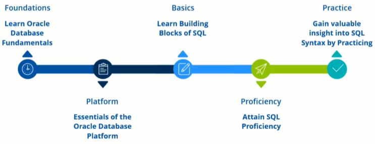

# Oracle SQL Practice Course

Offered by 
### *LearnQuest*

Taught by: [Rafiq Wayani](https://www.coursera.org/instructor/~76307871)

---

**6 hours** to complete - 2 quizzes

---

## Course description

>"This course is designed for SQL beginners to review SQL statements, including creating tables, adding columns, and modifying tables. We'll look at using alter statements and learners will practice using DDL and DML statements completing exercises."

More details on <a href="https://www.coursera.org/learn/oracle-sql-practice">website</a>

## Content
This folder contains 
- [x] [source codes](./Codes) from the practices and the exercises
- [x] [certificate](./Coursera_Certificate_Oracle_SQL_Practice_Course.pdf) ([verification](https://coursera.org/verify/R65J73TPK3G7))

## Syllabus

#### Module 1: SQL Review 

>"In this module, first, we will discuss what you will learn in this practice course. Then, we'll review types of SQL statements and take a look at developing a Data Model. We'll also walk through how to install SQL Plus and Oracle SQL Developer so you can follow along with some of our activities."
>- Describe what you'll review in this course
>- Explain Relational Databases
>- Describe the process of designing an Entity Relationship Diagram
>- List and describe the types of SQL statements
>- Define the steps of Data Modeling

#### Module 2: Data Definition Language (DDL) and Data Manipulation Language (DML) ([Practices](./Codes/module2.sql))

>"In this module, we will review creating tables and adding columns to them as well as some best practices. We will also review using alter statements to modify our database. Lastly, we'll look at DML statements."
>- Use the Create Statement to create a table
>- Use the Alter Statement to modify a table
>- Understand what alter statements can do
>- Practice using DML Statements
>- Practice Using DDL Statements

#### Module 3: Practice Writing SQL Code ([Exercises](./Codes/Exercises.md))

>"In this module, we'll put you to the test. You'll be able to create tables and modify them to test what you've learned to this point. Use SQLPlus if you installed it on you own machine, or go to https://livesql.oracle.com/ if you need an online way to test your code."
>- Practice using DML Statements
>- Practice Using DDL Statements
>- Use the Create Statement to create a table

## Remark

The first slide of the course shows that this course is meant to be the continuation of the [Oracle SQL Databases Specialization](../../Specializations/Oracle%20SQL%20Databases).

